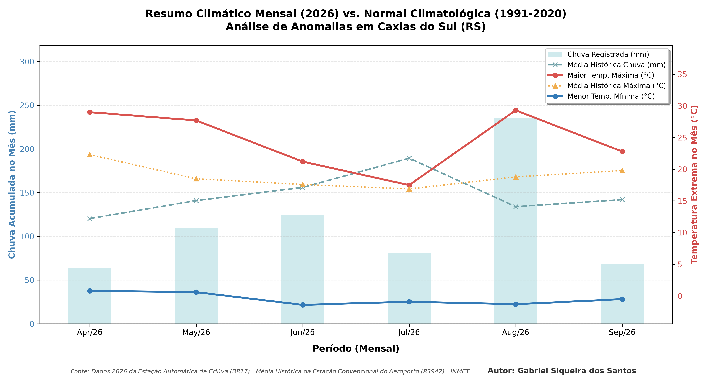

# Análise Climática de Caxias do Sul - RS

Este projeto automatiza a leitura e a geração de gráficos climáticos (temperaturas extremas e precipitação acumulada) utilizando dados históricos públicos obtidos junto ao INMET.

###  Nota Técnica sobre a Origem dos Dados ###

Os dados climáticos recentes (2026) utilizados neste projeto foram coletados pela estação meteorológica automática de **Criúva (B817)**. Para fins de análise comparativa, esses dados foram cruzados com a **Normal Climatológica (1991-2020)** da estação convencional do **Aeroporto de Caxias do Sul (83942)**, visto que é a única série histórica centenária disponível no município. Pequenas divergências milimétricas ou térmicas observadas nos gráficos são esperadas devido às diferenças geográficas e de microclima entre o distrito rural e a zona urbana.

## Insights Estatísticos e Análise de Anomalias

Ao cruzar os dados coletados com a **Normal Climatológica Oficial do INMET (1991-2020)**, o projeto permite identificar desvios e anomalias climáticas em Caxias do Sul - RS:

**Identificação de Extremos de Chuva:** Através das linhas tracejadas, é possível notar visualmente quais meses registraram volumes de chuva atipicamente acima ou abaixo da média histórica de 30 anos da região.

**Comportamento das Máximas:** A comparação entre as temperaturas máximas registradas e a linha da média climatológica revela se o período analisado apresentou um comportamento mais quente ou mais ameno do que o esperado para as respectivas estações do ano.

**Ocorrência de Outliers Reais:** Eventos em que as barras ou linhas se distanciam drasticamente das linhas pontilhadas de referência indicam anomalias climáticas reais e não falhas de sensores técnicos, validando a consistência dos dados do INMET.

## A Anomalia Climática de Agosto de 2026

O gráfico gerado pelo projeto revelou um comportamento atmosférico completamente atípico no município de Caxias do Sul - RS durante o mês de **Agosto de 2026**:

 **Extremo Térmico (Inverno Quente):** Enquanto a Normal Climatológica (1991-2020) indica que a média das temperaturas máximas para agosto deveria orbitar na casa dos **18.8°C**, a linha de dados reais do projeto capturou um pico próximo aos **30°C**. Este desvio marcante ilustra graficamente a ocorrência do fenômeno regional conhecido como **"Veranico de Agosto"**, onde massas de ar quente e seco bloqueiam temporariamente o inverno sulista.

 **Superávit Pluviométrico:** O acumulado de chuvas disparou para a faixa dos **250 mm**, ficando muito acima da média histórica esperada para o período (que é de 134.0 mm). 

Esse contraste severo entre os dados recentes e as linhas de base históricas comprova a eficiência do script em destacar anomalias climáticas visuais e picos de eventos extremos a partir de dados brutos.

## Funcionalidades
- Conversão automática dos padrões de dados do INMET.
- Agrupamento estatístico mensal.
- Gráfico climatológico misto (Barras para chuva e linhas para temperatura).

## Tecnologias Utilizadas
- Python 3.13
- Pandas
- Matplotlib
- Numpy
